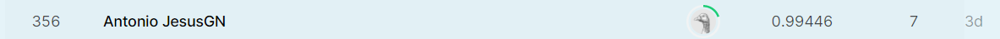

# Kaggle_Digit_Recognition

En este repositorio de guardará información para tratar con datos referentes a la competición de kaggle: https://www.kaggle.com/c/digit-recognizer

En esta competición nuestro trabajo consistirá en realizar una clasificación multiple.

El objetivo es perfecionar un modelo de deep learning que permita reconocer números en imágenes.
Para ello el conjunto de datos consta de dos .csv uno con las imágenes de entrenamiento y otro con las imágenes de test.

# Conceptos que se han trabajado en esta competición.

 - Transfer learning.
 - Fine tuning.
 - Técnicas de reducción del overfitting (sobreajuste). Entre ellas disminución del tamaño de redes, regularización de los pesos de las neuronas, dropout y bachnormalizactión.

# Resultados

